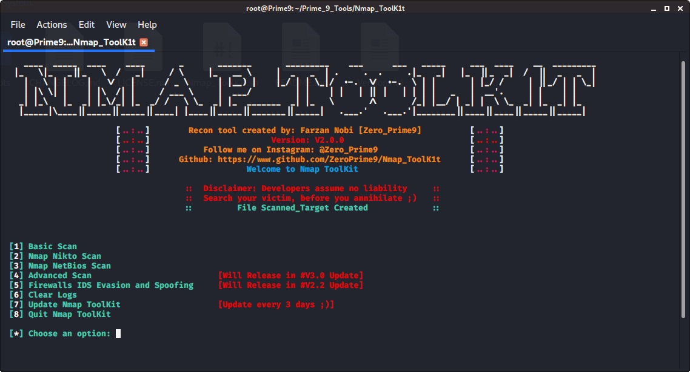

# Nmap_ToolK1t

Nmap made simpler with multiple scan techniques and more

### It would be appreciated if you gave credit when redistributing versions of this code, modified or unmodified, source code or executable :)

## ABOUT:
Nmap_ToolK1t is an automated scanner that can be used during a penetration test to enumerate and scan for vulnerabilities. This tool is made for making Nmap scans simpler and automated, depending on user preference.

## Getting Started:
```
git clone https://github.com/ZeroPrime9/Nmap_ToolK1t
cd Nmap_ToolK1t
bash Nmap_ToolK1t.sh
```

## Prerequisites:

First of all, you should get the “nmap” package installed in your system.

```
On Cent OS
yum install nmap
```
```
On Debian / Ubuntu
apt-get install nmap
```
## Features:
- The purpose of Nmap Toolkit is to provide easy automated scanning from Basic Scanning Techniques, Advanced Scanning Techniques, Firewalls, IDS and Spoofing Techniques to Nikto and Netbios scans using Nmap.
- It helps beginner or Advanced pen-testers to keep everything at pace and simplified.
- Each branched scan has multiple yet specified scans for both IP/website and from a specified file

## Purpose:

The whole reason for using making this tool, is to make reconnaissance simpler and making things faster. As this is still in V1.0 there are only basic scans techniques. More scans will be added and over time automation will be made more and more easier.

All the scans made are stored in Scanned_Target directory.

## LICENSE:
Nmap_ToolK1t- is licensed under the
GNU General Public License v3.0

Permissions of this strong copyleft license are conditioned on making available complete source code of licensed works and modifications, which include larger works using a licensed work, under the same license. Copyright and license notices must be preserved. Contributors provide an express grant of patent rights. See the [LICENSE.md](LICENSE.md)

## CHANGELOGS:
See the [CHANGELOG.md](CHANGELOG.md) file for Version history and changes.

## Issues
There are some known issues found in machines in linux distributions other than Kali, an update is planned for the purpose of fixing these issues.

## Authors:

* **Zero_Prime9** - *Initial work* -(https://github.com/ZeroPrime9)

## Donation:
Any type of donation would be accepted, Working on an Open Source tool requires a lot of time and dedication. So if you are willing to share $1 or more it would really be appreciated
https://www.paypal.me/fz2050
